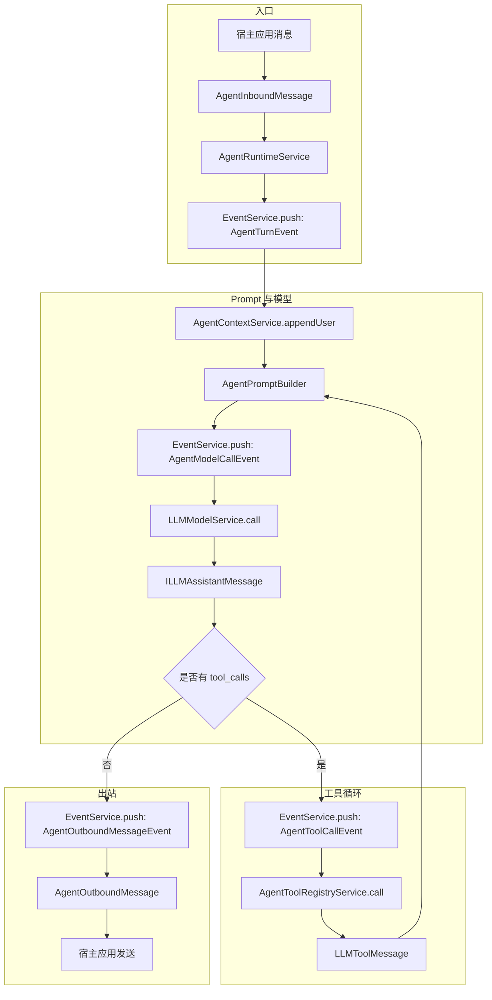

# 一. TeaNeko Agent 结构介绍

`teanekoagent` 是 TeaNeko 的 Agent 能力层，负责把 `llm` 提供的消息、Prompt、模型调用和 Function Tool 能力组合成人格、记忆、工具和对话运行时。该包只处理平台无关的 Agent 逻辑，不直接依赖具体聊天平台事件、客户端或发送器。

| 模块 | 作用 |
|:---:|---|
| `agent` | 对话上下文、Prompt 构建入口、上下文压缩、Agent 运行时和平台无关入站/出站 DTO。 |
| `agent.event` | Agent 运行时事件，提供整轮对话、模型调用、工具调用和出站消息的拦截点。 |
| `file_config` | Agent 主配置和 token 监控器配置读取入口。 |
| `agent.prompt` | 将运行硬规则、基础人格、学习修正、长期记忆和额外组件按优先级拼装成 LLM Prompt。 |
| `agent.token` | token 使用量日志、上下文快照、清理策略和 token 告警事件。 |
| `memory` | 带事件时间和重要度的长期记忆 DTO、人格学习修正、时间范围查询和显式记忆工具。 |
| `personality` | 根据 scope、agentId、userId 解析当前 active personality、边界策略、记忆和模型 options。 |
| `personality.config` | Agent 运行配置 DTO、字段校验和配置读取 port。 |
| `personality.file_config` | 文件基础人格配置模型和读取服务。 |
| `tool` | 合并 LLM framework 工具和外部 Agent 工具 provider，形成统一 `ILLMTool` 视图。 |
| `database` | 基于 EasyData 的 LLM/Agent 相关 KV 数据入口。 |
| `llm` | 通用 LLM framework。Agent 层复用其中的 message、prompt、model、tool 抽象，不重复实现。 |
| `_app_config` | Spring 装配相关配置，本 README 不展开。 |

# 二. 运行入口

| 类或接口 | 作用 |
|:---:|---|
| `AgentRuntimeService` | 处理一次入站消息，推送 Agent 事件，执行默认模型调用和 tool call loop，并返回 `AgentOutboundMessage`。 |
| `AgentContextService` | 创建和维护会话上下文，解析人格、构建 prompt、压缩消息和写入暂存记忆。 |
| `AgentToolRegistryService` | 获取并执行当前 Agent 可见的工具。 |
| `AgentPersonalityResolver` | 解析基础人格、自定义配置、学习修正、长期记忆和模型 options。 |
| `AgentMemoryQueryService` | 按确定性 key 查询和写入长期记忆。 |
| `IAgentHostPort` | 宿主应用接入 Agent 的最小 port，负责 scope 解析、发送和用户资料查询。 |

# 三. 主流程

# 四. 阅读顺序

| 顺序 | 导航 | 说明 |
|---|---|---|
| $1$ | [agent/README.md](agent/README.md) | 对话如何进入 Agent Runtime、上下文如何维护、tool call loop 如何结束。 |
| $2$ | [agent/event/README.md](agent/event/README.md) | 运行时事件、监听器扩展点、取消事件后的默认行为。 |
| $3$ | [file_config/README.md](file_config/README.md) | Agent 主配置、模型配置迁移路径、token 监控器配置结构。 |
| $4$ | [agent/token/README.md](agent/token/README.md) | token 使用摘要、上下文快照、清理策略和 warning 事件顺序。 |
| $5$ | [personality/README.md](personality/README.md) | active personality、边界策略、学习修正和模型参数解析。 |
| $6$ | [memory/README.md](memory/README.md) | 长期记忆、关系记忆、人格修正记录和存储方式。 |
| $7$ | [tool/README.md](tool/README.md) | Agent 工具如何复用 LLM framework 的 Function Tool。 |
| $8$ | [database/README.md](database/README.md) | LLM/Agent 相关 EasyData namespace 和存储约定。 |
| $9$ | [llm/framework/README.md](llm/framework/README.md) | LLM message、prompt、model、tool 和 usage 抽象。 |
| $10$ | [llm/file_config/README.md](llm/file_config/README.md) | `config/agent/model.yml` 的读取顺序和模型 options 合并规则。 |
| $11$ | [llm/instance/deepseek/README.md](llm/instance/deepseek/README.md) | DeepSeek 适配器的请求映射、可选字段忽略和 usage 解析。 |

# 五. 关键约定

| 约定 | 说明 |
|---|---|
| scopeId + agentId | 配置、人格、记忆和 Prompt 构建的统一定位键。 |
| userId | 用户画像、偏好和关系记忆的主体 ID。 |
| 基础人格优先 | 文件或自定义基础人格不能被学习记忆覆盖。 |
| 学习内容降权 | 人格修正和长期记忆只能补充偏好、关系和表达细节。 |
| LLM 复用边界 | Agent 层使用 `ILLMMessage`、`LLMPrompt`、`LLMModelOptions`、`ILLMTool` 和 `ILLMToolCall`，不新增平行抽象。 |
| 事件驱动边界 | 可扩展节点使用 `teanekocore.event`，监听器可修改事件 data 或取消默认动作。 |
| tool call loop | 工具调用必须有最大轮数，工具异常要作为 tool message 回填给模型。 |
| token 监控 | 模型调用后记录 `ILLMUsage`，上下文快照写入 `CleanableEasyData`，单轮结束后按阈值推送 `AgentTokenWarningEvent` 并写入 warn。 |
| 时间维度 | 会话保存消息发生时间和记录时间；记忆区分事件时间与记录生命周期，并支持 Agent 通过 Tool 按时间点或范围检索。 |
| 应用隔离 | Agent Core 不直接处理平台事件或发送器，宿主应用通过 adapter 转换 DTO。 |

# 六. 受控思考输出

`agent.thinking` 在每次模型调用前复用当前历史消息、人格、重要记忆和时间上下文，并通过有限步骤完成分析、工具观察和最终校验。最终返回的 `AgentOutput` 将思考摘要、用户答案和 metadata 分离，宿主 adapter 仍只发送最终答案。

|顺序|导航|说明|
|---|---|---|
|$1$|[agent/README.md](agent/README.md)|了解完整对话、上下文、工具和输出流程。|
|$2$|[agent/thinking/README.md](agent/thinking/README.md)|了解思考步骤预算、结构化 JSON、输出字段和供应商推理隔离。|
|$3$|[file_config/README.md](file_config/README.md)|了解思考模式和摘要长度配置。|
