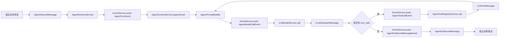

# 一. TeaNeko Agent 结构介绍

`teanekoagent` 是 TeaNeko 的 Agent 能力层，负责把 `llm` 提供的消息、Prompt、模型调用和 Function Tool 能力组合成人格、记忆、工具和对话运行时。该包只处理平台无关的 Agent 逻辑，不直接依赖具体聊天平台事件、客户端或发送器。

| 模块 | 作用 |
|:---:|---|
| `agent` | 对话上下文、Prompt 构建入口、上下文压缩、Agent 运行时和平台无关入站/出站 DTO。 |
| `agent.event` | Agent 运行时事件，提供整轮对话、模型调用、工具调用和出站消息的拦截点。 |
| `agent.prompt` | 将运行硬规则、基础人格、学习修正、长期记忆和额外组件按优先级拼装成 LLM Prompt。 |
| `memory` | 长期记忆 DTO、人格学习修正记录、记忆查询写入服务和显式记忆工具。 |
| `personality` | 根据 scope、agentId、userId 解析当前 active personality、边界策略、记忆和模型 options。 |
| `personality.config` | Agent 运行配置 DTO、字段校验和配置读取 port。 |
| `personality.file_config` | 文件基础人格配置模型和读取服务。 |
| `tool` | 合并 LLM framework 工具和外部 Agent 工具 provider，形成统一 `ILLMTool` 视图。 |
| `database` | 基于 EasyData 的 LLM/Agent 相关 KV 数据入口。 |
| `llm` | 通用 LLM framework。Agent 层复用其中的 message、prompt、model、tool 抽象，不重复实现。 |
| `_app_config` | Spring 装配相关配置，本 README 不展开。 |

# 二. 运行入口

| 类或接口 | 作用 |
|:---:|---|
| `AgentRuntimeService` | 处理一次入站消息，推送 Agent 事件，执行默认模型调用和 tool call loop，并返回 `AgentOutboundMessage`。 |
| `AgentContextService` | 创建和维护会话上下文，解析人格、构建 prompt、压缩消息和写入暂存记忆。 |
| `AgentToolRegistryService` | 获取并执行当前 Agent 可见的工具。 |
| `AgentPersonalityResolver` | 解析基础人格、自定义配置、学习修正、长期记忆和模型 options。 |
| `AgentMemoryQueryService` | 按确定性 key 查询和写入长期记忆。 |
| `IAgentHostPort` | 宿主应用接入 Agent 的最小 port，负责 scope 解析、发送和用户资料查询。 |

# 三. 主流程

# 四. 阅读顺序

1. 先读 [agent/README.md](agent/README.md)，了解一次对话如何进入 Agent Runtime。
2. 再读 [agent/event/README.md](agent/event/README.md)，了解运行时事件和监听器扩展点。
3. 然后读 [personality/README.md](personality/README.md)，了解 active personality、边界和模型参数如何解析。
4. 接着读 [memory/README.md](memory/README.md)，了解长期记忆和人格学习修正的存储方式。
5. 再读 [tool/README.md](tool/README.md)，了解 Agent 如何复用 LLM framework 的 Function Tool。
6. 最后读 [database/README.md](database/README.md)，了解 LLM/Agent 相关 EasyData 的存储约定。

# 五. 关键约定

| 约定 | 说明 |
|---|---|
| scopeId + agentId | 配置、人格、记忆和 Prompt 构建的统一定位键。 |
| userId | 用户画像、偏好和关系记忆的主体 ID。 |
| 基础人格优先 | 文件或自定义基础人格不能被学习记忆覆盖。 |
| 学习内容降权 | 人格修正和长期记忆只能补充偏好、关系和表达细节。 |
| LLM 复用边界 | Agent 层使用 `ILLMMessage`、`LLMPrompt`、`LLMModelOptions`、`ILLMTool` 和 `ILLMToolCall`，不新增平行抽象。 |
| 事件驱动边界 | 可扩展节点使用 `teanekocore.event`，监听器可修改事件 data 或取消默认动作。 |
| tool call loop | 工具调用必须有最大轮数，工具异常要作为 tool message 回填给模型。 |
| 应用隔离 | Agent Core 不直接处理平台事件或发送器，宿主应用通过 adapter 转换 DTO。 |
