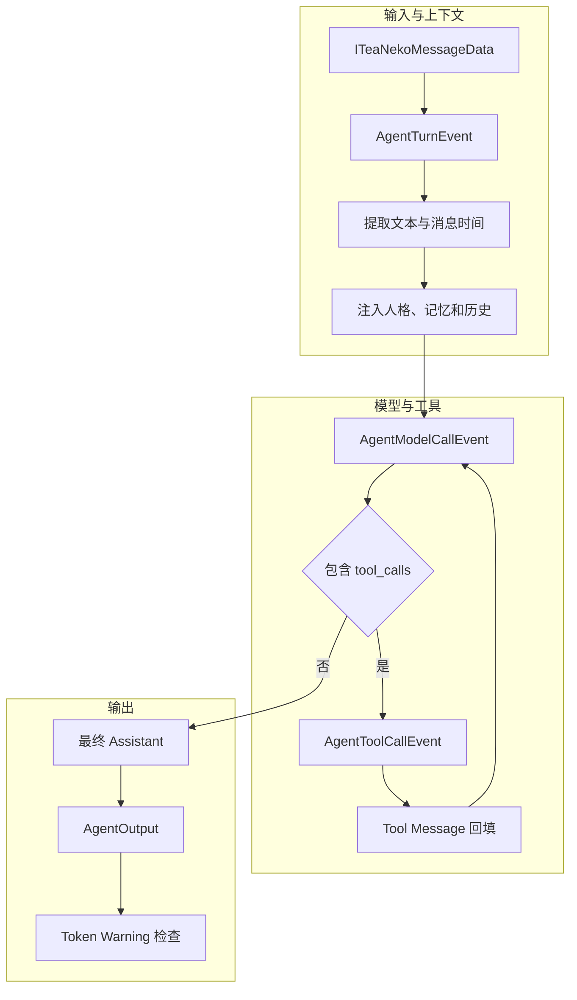

# 一、Agent Runtime

`AgentRuntimeService` 处理一次 `ITeaNekoMessageData`。它从 TeaNeko content 中提取文本，将消息时间写入会话时间轴，注入人格、重要记忆和历史上下文，执行受步数限制的模型与工具循环，最终返回 `Optional<AgentOutput>`。

| 类 | 作用 |
|---|---|
| `AgentRuntimeService` | 执行单轮对话、模型调用、工具回填和结构化输出。 |
| `AgentConversationRegistryService` | 让内置 Agent client 在多次 sender 调用间复用会话。 |
| `AgentContextService` | 创建上下文、解析人格、构建 Prompt、压缩历史和持久化暂存记忆。 |
| `AgentConversationContext` | 保存消息历史、时间轴、人格状态和暂存记忆。 |
| `AgentTurnData` | 在事件链中保存原生 TeaNeko 消息、模型结果、AgentOutput 和 token 记录。 |

# 二、处理流程

# 三、核心 API

| API | 说明 |
|---|---|
| `handle(context, ITeaNekoMessageData)` | 使用默认工具轮数处理一条原生 TeaNeko 消息。 |
| `handle(context, message, maxToolRounds)` | 显式限制工具调用轮数。 |
| `AgentConversationRegistryService.getOrCreate(...)` | 获取或创建身份边界一致的会话。 |
| `AgentContextService.buildPrompt(...)` | 注入人格、记忆、时间与历史消息。 |
| `AgentTurnData.findAgentOutput()` | 获取当前轮次生成的结构化输出。 |

# 四、推荐阅读顺序

|顺序|导航|说明|
|---|---|---|
|$1$|[event/README.md](event/README.md)|了解整轮、模型、工具和 token 警告事件。|
|$2$|[thinking/README.md](thinking/README.md)|了解思考步数限制、公开摘要和 AgentOutput。|
|$3$|[token/README.md](token/README.md)|了解 token 记录、清理和警告。|
|$4$|[../memory/README.md](../memory/README.md)|了解上下文注入和工具查询使用的长期记忆。|

# 五、边界

Runtime 不负责向外部聊天平台发送消息。手动操作由 `teanekoagent.sender` 中的 Agent sender 发起，内置 Agent client 执行后通过 Agent response event 完成异步任务；App 仅提供通用 sender、client 和 response 基础设施。
