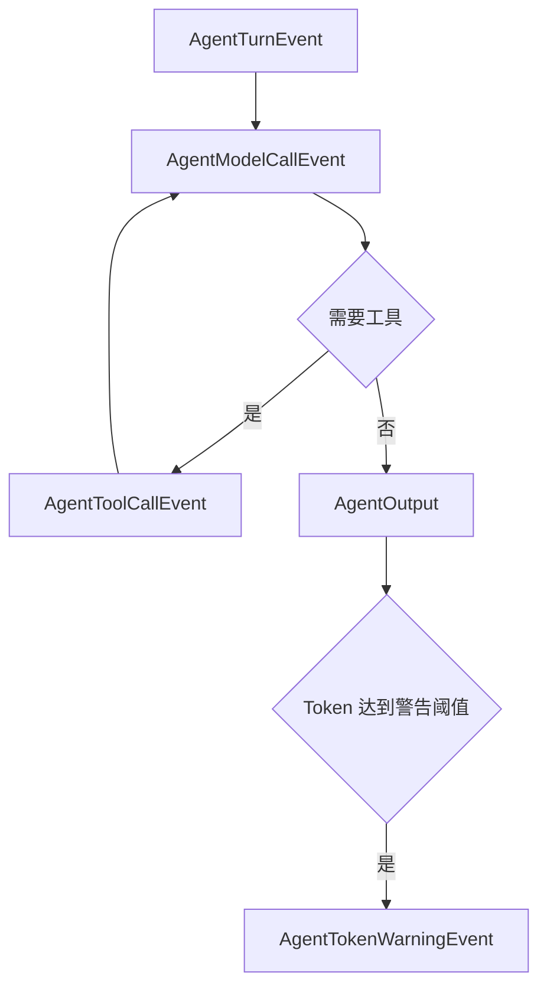

# 一、Agent 运行事件

| 事件 | 默认行为 | 扩展用途 |
|---|---|---|
| `AgentTurnEvent` | 调用 `AgentRuntimeService.__handleForEvent(...)`。 | 取消整轮处理、调整工具轮数或工具包。 |
| `AgentModelCallEvent` | 调用 `LLMModelService.call(...)`。 | 修改 Prompt、替换模型结果或取消调用。 |
| `AgentToolCallEvent` | 调用 `AgentToolRegistryService.call(...)`。 | 审计、替换或取消工具调用。 |
| `AgentTokenWarningEvent` | 由 token 监控器在阈值触发时推送。 | 监听高消耗、上下文接近耗尽或异常调用。 |

Agent 的最终发送结果不再使用 Runtime 出站事件。App 手动操作通过 `AgentSentEvent` 发起，并由 `AgentResponseEvent` 返回。

# 二、事件关系

# 三、推荐阅读顺序

|顺序|导航|说明|
|---|---|---|
|$1$|[../README.md](../README.md)|了解事件在完整 Agent Runtime 中的位置。|
|$2$|[../../sender/README.md](../../sender/README.md)|了解 App sender 事件。|
|$3$|[../../response/README.md](../../response/README.md)|了解异步响应事件。|
