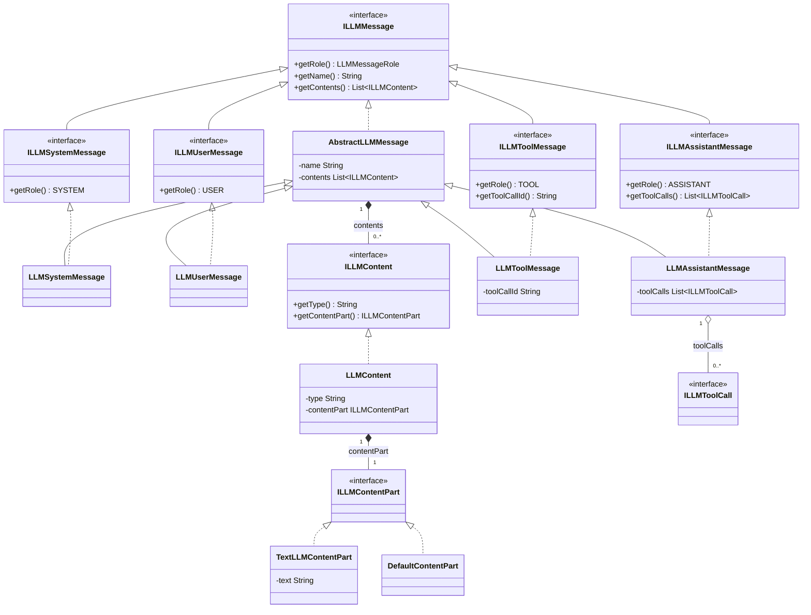
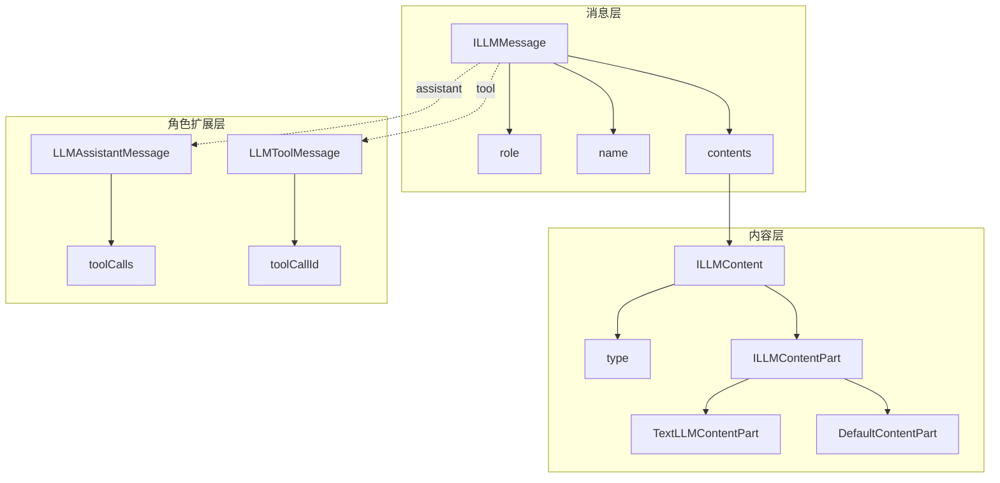
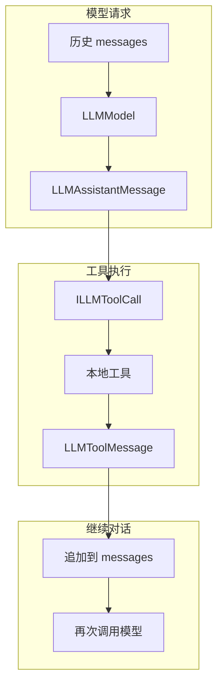

# 一. LLM Message 模块结构介绍

`message` 模块定义发送给大语言模型以及由模型返回的统一消息结构。供应商适配器只需要把这些接口转换为目标 API 的 JSON，不应在适配器中重新定义 system、user、assistant 或 tool 消息。

一个 `LLMMessage` 由以下部分组成：

|组成|类型|说明|
|---|---|---|
|角色|`LLMMessageRole`|标识消息来自 system、user、assistant 或 tool。|
|参与者名称|`String name`|用于区分相同角色的不同参与者；默认为空字符串。|
|正文|`List<ILLMContent> contents`|消息内容列表，每项由内容类型和具体 content part 组成。|
|工具调用|`List<ILLMToolCall> toolCalls`|仅 assistant 消息使用，表示模型希望执行的工具。|
|工具调用 ID|`String toolCallId`|仅 tool 消息使用，用于关联 assistant 发起的工具调用。|

# 二. 类 UML



# 三. 对象组成



`LLMContent` 自身不直接保存具体文本字段，而是通过 `contentPart` 组合实际内容。当前内置的 `TextLLMContentPart` 保存文本；无法映射到已知类型的内容可以使用 `DefaultContentPart` 承载。

# 四. 消息角色

|角色|接口|默认实现|用途|
|---|---|---|---|
|`system`|`ILLMSystemMessage`|`LLMSystemMessage`|提供系统规则、行为边界和全局上下文。|
|`user`|`ILLMUserMessage`|`LLMUserMessage`|表示用户输入或其他用户角色提供的内容。|
|`assistant`|`ILLMAssistantMessage`|`LLMAssistantMessage`|表示模型输出，可同时携带 `tool_calls`。|
|`tool`|`ILLMToolMessage`|`LLMToolMessage`|把本地工具结果回填给模型，并通过 `tool_call_id` 关联请求。|

角色由各角色接口的 `getRole()` 默认实现提供。业务代码应依赖 `ILLMMessage` 及其角色接口；需要直接构造框架消息时再使用对应的默认实现类。

# 五. Content 结构

一个文本 content 的 Java 对象结构如下：

```text
LLMContent
├── type = "text"
└── contentPart = TextLLMContentPart
    └── text = "用户输入"
```

可以使用 `LLMContentListBuilder` 构造内容列表：

```java
List<ILLMContent> contents = LLMContentListBuilder.builder()
        .addText("第一段文本")
        .addText("第二段文本")
        .build();
```

`build()` 返回不可变列表。当前 builder 直接支持文本内容；新增图片、音频或文件类型时，应先实现新的 `ILLMContentPart`，再扩展 builder 和供应商映射器。

# 六. 构造 Message List

普通对话优先使用 `LLMMessageListBuilder`：

```java
List<ILLMMessage> messages = LLMMessageListBuilder.builder()
        .addSystem("policy", "必须使用简洁、准确的回答。")
        .addUser("alice", "查询今天的任务。")
        .addAssistant("正在查询任务。")
        .addTool("call-1", "{\"tasks\":[]}")
        .build();
```

|方法|说明|
|---|---|
|`add(ILLMMessage)` / `addMessage(ILLMMessage)`|直接加入已有消息对象。|
|`addSystem(...)`|使用字符串或 content list 创建 system 消息。|
|`addUser(...)`|使用字符串或 content list 创建 user 消息。|
|`addAssistant(...)`|使用字符串或 content list 创建 assistant 消息。|
|`addTool(toolCallId, result)`|使用工具调用 ID 和结果文本创建 tool 消息。|
|`build()`|返回不可变的 `List<ILLMMessage>`。|

system、user 和 assistant 方法均提供带 `name` 的重载。传入 `null` 名称时会被规范化为空字符串。

需要设置 assistant 的 `toolCalls` 或 tool 的 `name` 时，可以直接使用 Lombok builder：

```java
ILLMToolMessage toolMessage = LLMToolMessage.builder()
        .name("search_memory")
        .toolCallId("call-1")
        .contents(LLMContentListBuilder.builder()
                .addText("检索结果")
                .build())
        .build();
```

# 七. JSON 序列化规则

`AbstractLLMMessage` 统一处理公共字段及 content 序列化：

|场景|JSON 行为|
|---|---|
|`name == null` 或 `name.isEmpty()`|忽略 `name` 字段，不写入请求 JSON。|
|`contents == null`|输出 `"content": null`。|
|`contents` 为空列表|输出 `"content": ""`。|
|所有 content 都是 `TextLLMContentPart`|按顺序使用空格合并，输出单个字符串。|
|包含非文本 content|输出 content object 数组，保留各内容的结构。|
|assistant 消息|额外输出 `tool_calls`。|
|tool 消息|额外输出 `tool_call_id`。|

例如：

```java
LLMUserMessage.builder()
        .name("alice")
        .contents(LLMContentListBuilder.builder()
                .addText("你好")
                .addText("请介绍当前项目")
                .build())
        .build();
```

纯文本模式会序列化为类似结构：

```json
{
  "role": "user",
  "name": "alice",
  "content": "你好 请介绍当前项目"
}
```

未设置 `name` 时，该字段不会进入 JSON。这一规则用于减少无意义请求字段，并兼容不要求参与者名称的模型 API。

# 八. Tool Call 闭环



`LLMToolMessage.toolCallId` 必须与 assistant 消息中对应 `ILLMToolCall` 的 ID 一致，否则供应商可能无法把工具结果关联到原始调用。

# 九. 扩展约定

|约定|说明|
|---|---|
|依赖接口|对话、Prompt 和模型服务优先依赖 `ILLMMessage`、`ILLMContent` 等接口。|
|复用公共类|供应商适配器只负责协议映射，不创建平行的通用 Message 抽象。|
|保留角色语义|不要用 user 消息模拟 tool 结果，也不要用 system 消息承载普通用户输入。|
|保持关联 ID|tool result 必须保留发起调用时的 tool call ID。|
|谨慎扩展 content|新增 content part 后，需要同步实现 JSON 序列化和供应商请求映射。|

# 十. 阅读顺序

|顺序|导航|说明|
|---|---|---|
|$1$|[../README.md](../README.md)|了解 Message 在 LLM Framework、Prompt 和模型适配器中的位置。|
|$2$|[interfaces/ILLMMessage.java](interfaces/ILLMMessage.java)|了解所有消息必须提供的角色、名称和正文契约。|
|$3$|[AbstractLLMMessage.java](AbstractLLMMessage.java)|了解公共字段和 content JSON 序列化规则。|
|$4$|[LLMMessageListBuilder.java](LLMMessageListBuilder.java)|了解常规消息列表的构造入口。|
|$5$|[content/LLMContentListBuilder.java](content/LLMContentListBuilder.java)|了解文本 content 的构造方式。|

