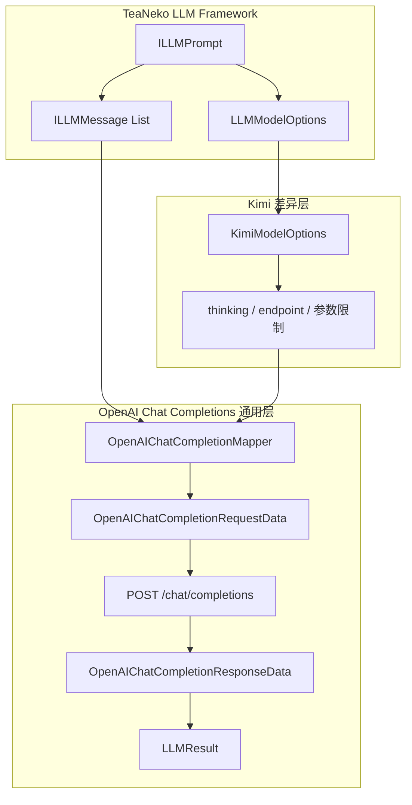

# 一. Kimi Instance 结构介绍

`llm/instance/kimi` 是 Kimi Chat Completions 模型适配器，注册 ID 为 `kimi`。它继承 [`AbstractOpenAIChatCompletionModel`](../openai/completions/README.md)，复用通用请求 DTO、消息映射、Function Tool、JSON Schema、usage 和响应转换，仅保留 Kimi endpoint、thinking 与模型参数限制。

|文件|作用|
|---|---|
|`KimiChatModel`|注册 ID 为 `kimi` 的 Spring 模型适配器。|
|`KimiModelOptions`|继承通用 Chat Completions options，补充 Kimi thinking、Prompt 缓存和安全标识。|
|[`openai/completions`](../openai/completions/README.md)|提供 Kimi 复用的请求、响应、mapper 和抽象模型。|

# 二. 默认配置

|项目|值|
|---|---|
|注册 ID|`kimi`|
|默认模型|`kimi-k2.6`|
|固定 base URL|`https://api.moonshot.cn/v1`|
|默认 API path|`/chat/completions`|
|协议|OpenAI Chat Completions 兼容协议|
|流式响应|当前适配器不支持|

```yaml
models:
  - id: "kimi"
    model: "kimi-k2.6"
    api-key: "${KIMI_API_KEY}"
    api: "/chat/completions"
    max-tokens: 4096
    thinking: true
    metadata:
      kimi.thinkingKeep: true
      kimi.promptCacheKey: ""
      kimi.safetyIdentifier: ""
```

模型路由只使用 `id: kimi`。`model` 可以覆盖为 `kimi-k2.7-code`、`kimi-k2.6` 或其他兼容模型名称。

# 三. 调用流程



# 四. Message 与 Tool 映射

|TeaNeko Framework|Kimi Chat Completions|
|---|---|
|`ILLMMessage.role`|`messages[].role`|
|非空 `name`|`messages[].name`|
|文本 Content|`messages[].content`|
|assistant `toolCalls`|`messages[].tool_calls`|
|`LLMToolMessage.toolCallId`|`messages[].tool_call_id`|
|`ILLMTool`|`tools[].function`|

Function Tool 参数 schema、消息和工具调用均由 Chat Completions 通用 mapper 转换。Kimi strict 模式默认值与其他供应商不同，因此通用 mapper 会显式写入 `strict: true/false`。

# 五. Thinking

Kimi thinking 结果通过 `reasoning_content` 返回。该字段不会作为 assistant 正文或 Agent 用户输出暴露，而是保存在 `ILLMMessage.providerMetadata` 中；模型发起工具调用后，下一轮请求会将它原样回传。

|模型|行为|
|---|---|
|`kimi-k2.6`|支持 `thinking.type = enabled/disabled`；`kimi.thinkingKeep` 映射为 `thinking.keep`。|
|`kimi-k2.7-code`|固定开启 thinking，API 不接受 `thinking` 请求字段；适配器会自动忽略该字段并拒绝 `thinking: false`。|

# 六. 参数映射

|LLM options|Kimi 请求字段|
|---|---|
|`model`|`model`|
|`maxTokens`|`max_completion_tokens`|
|`thinking`|K2.6 的 `thinking.type`|
|`temperature`|`temperature`，K2 系列不允许设置。|
|`topP`|`top_p`，K2 系列不允许设置。|
|`frequencyPenalty`|`frequency_penalty`，K2 系列不允许设置。|
|`presencePenalty`|`presence_penalty`，K2 系列不允许设置。|
|`responseFormat = JSON`|`response_format.type = json_object`|
|`stopWords`|`stop`，K2 系列不允许设置。|
|`tools`|`tools[].function`|
|`toolChoice`|`tool_choice`|
|`kimi.promptCacheKey`|`prompt_cache_key`|
|`kimi.safetyIdentifier`|`safety_identifier`|

`KimiModelOptions` 将 thinking、缓存键和安全标识转换为 `body.*` metadata，再由通用 Chat Completions mapper 写入请求体。其他 `body.*` 非空字段同样可以透传。

# 七. Usage 映射

|Kimi usage|LLMUsage|
|---|---|
|`prompt_tokens`|`promptTokens`|
|`completion_tokens`|`completionTokens`|
|`total_tokens`|`totalTokens`|
|`prompt_tokens_details.cached_tokens`|`promptCacheHitTokens`|
|Prompt token 减缓存 token|`promptCacheMissTokens`|
|`completion_tokens_details.reasoning_tokens`|`reasoningTokens`|

# 八. 官方资料

|导航|说明|
|---|---|
|[开始使用 Kimi API](https://platform.kimi.com/docs/guide/start-using-kimi-api)|官方 endpoint、API key 和 OpenAI SDK 调用示例。|
|[模型列表](https://platform.kimi.com/docs/guide/model-list)|K2.6、K2.7 Code 等模型能力和参数限制。|
|[Chat Completions API](https://platform.kimi.com/docs/api/chat-completion)|请求字段、thinking、工具调用和响应结构。|

# 九. 阅读顺序

|顺序|导航|说明|
|---|---|---|
|$1$|[../../framework/README.md](../../framework/README.md)|了解统一模型、Prompt、Tool 和 Result 抽象。|
|$2$|[../../framework/message/README.md](../../framework/message/README.md)|了解 Message、provider metadata 和工具消息结构。|
|$3$|[../openai/completions/README.md](../openai/completions/README.md)|了解 Kimi 复用的 Chat Completions 通用 DTO、mapper 和抽象模型。|
|$4$|[../../file_config/README.md](../../file_config/README.md)|了解 `id: kimi` 配置及 options 合并顺序。|
|$5$|[README.md](README.md)|了解 Kimi endpoint、thinking 和模型参数限制。|
