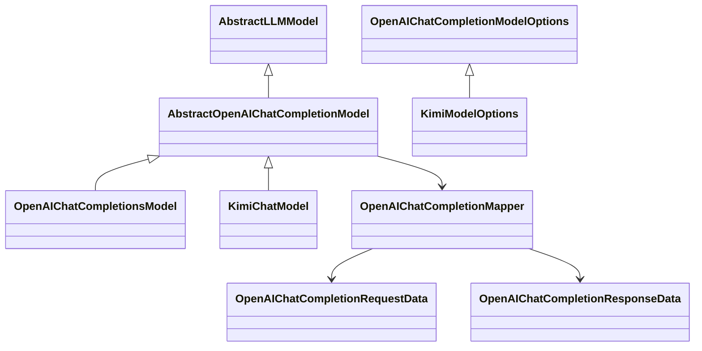
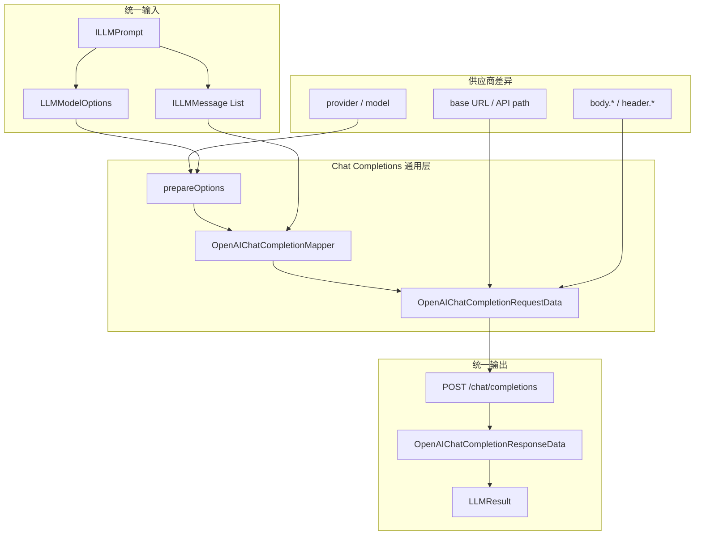

# 一. OpenAI Chat Completions 兼容层

`llm/instance/openai/completions` 实现 OpenAI Chat Completions 协议，但不直接注册模型。该模块作为兼容服务的扩展基座：Kimi 等服务只需要继承抽象模型、补充 endpoint 与供应商参数限制，并在具体类上添加 `@LLMModel`。

这里的 Completions 指对话接口 `POST /v1/chat/completions`，不是只接收单段 prompt 的旧式 `POST /v1/completions`。

|文件|作用|
|---|---|
|`OpenAIChatCompletionsModel`|未注册的 OpenAI Chat Completions 协议实现，用于复用 OpenAI 专用参数逻辑和测试。|
|`AbstractOpenAIChatCompletionModel`|兼容供应商的抽象模型，统一处理能力校验、认证、HTTP 调用和结果转换。|
|`OpenAIChatCompletionModelOptions`|通用 options、endpoint、额外请求体和请求头配置。|
|`OpenAIChatCompletionRequestData`|Chat Completions 请求 DTO。|
|`OpenAIChatCompletionResponseData`|Chat Completions 响应、工具调用和 usage DTO。|
|`OpenAIChatCompletionMapper`|统一 Message、Function Tool、JSON 输出、reasoning metadata 和 usage 映射。|

# 二. API 区别

|接口|TeaNeko 注册方式|主要输入|工具调用|定位|
|---|---|---|---|---|
|Responses API|`openai`|`input` item 列表|`function_call` / `function_call_output` item|OpenAI 新项目推荐接口，支持更完整的 Responses 能力。|
|Chat Completions API|通用层不注册，具体供应商子类使用 `@LLMModel`|`messages` 数组|assistant `tool_calls` 与 tool `tool_call_id`|成熟的对话兼容协议，适合接入大量兼容服务。|
|旧式 Completions API|未实现|单个 `prompt`|不适合当前工具循环|旧文本补全协议，不作为 Agent 对话主链路。|

# 三. 组成关系



# 四. 调用流程



# 五. 注册边界

`OpenAIChatCompletionsModel` 没有 `@LLMModel`，也不是 Spring Bean，因此不会出现在 `LLMModelService` 注册表中，`model.yml` 不应配置 `id: openai-completions`。

通用 mapper 会忽略空字符串、空集合和空 map。`body.<name>` 会转换为请求体的 `<name>` 字段，`header.<name>` 会转换为 HTTP 请求头。OpenAI 专用实现会将统一的 `thinking: true/false` 分别转换为 `reasoning_effort: medium/none`；需要其他强度时可直接配置 `body.reasoning_effort`。

# 六. 快速扩展兼容模型

兼容服务不需要复制 DTO 和 mapper。最小实现只需注册模型并提供默认 endpoint：

```java
@LLMModel(id = "vendor")
public class VendorChatModel extends AbstractOpenAIChatCompletionModel {
    public static final String PROVIDER = "vendor";

    public VendorChatModel(IAPIResponseService apiResponseService) {
        super(
                PROVIDER,
                "vendor-model",
                OpenAIChatCompletionModelOptions.baseOptions(
                        PROVIDER,
                        "vendor-model",
                        "https://api.vendor.example/v1"
                ),
                apiResponseService
        );
    }
}
```

`@LLMModel.id` 是唯一注册 ID 来源。继承 `AbstractOpenAIChatCompletionModel` 但没有该注解的类不会被模型服务发现。

供应商存在专用参数时，可以继承 `OpenAIChatCompletionModelOptions`，在 `getMetadata()` 中生成 `body.*` 字段，并在模型中重写 `prepareOptions(...)`。供应商不支持部分通用参数时，重写 `supportsChatCompletionOptions(...)`，避免配置被静默忽略。

# 七. Message 与 Tool 映射

|TeaNeko Framework|Chat Completions|
|---|---|
|`ILLMMessage.role`|`messages[].role`|
|非空 `name`|`messages[].name`|
|文本 Content|`messages[].content`|
|assistant `toolCalls`|`messages[].tool_calls`|
|`LLMToolMessage.toolCallId`|`messages[].tool_call_id`|
|`ILLMTool`|`tools[].function`|
|`responseFormat = JSON`|`response_format.type = json_object`|

兼容供应商返回的 `reasoning_content` 保存在 `ILLMMessage.providerMetadata` 的 `openai.chat.reasoningContent` 中，并可在后续工具调用轮次回传；它不会作为用户可见正文。

# 八. 阅读顺序

|顺序|导航|说明|
|---|---|---|
|$1$|[../../../framework/README.md](../../../framework/README.md)|了解统一 Prompt、Options、Tool 和 Result 抽象。|
|$2$|[../../../framework/message/README.md](../../../framework/message/README.md)|了解 Message、name、tool message 和 provider metadata。|
|$3$|[../README.md](../responses/README.md)|比较 OpenAI Responses API 与 Chat Completions API。|
|$4$|[../../kimi/README.md](../../kimi/README.md)|查看供应商专用 options 如何复用本兼容层。|
|$5$|[README.md](README.md)|了解通用请求映射、配置和快速扩展方式。|
