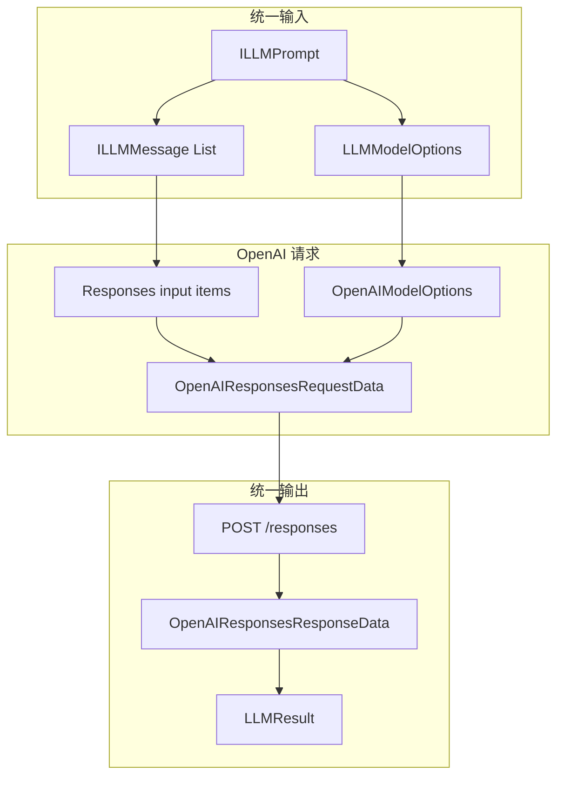

# 一. OpenAI Instance 结构介绍

`llm/instance/openai` 同时提供 OpenAI Responses API 和 Chat Completions 兼容层。Responses 适配器通过 `@LLMModel(id = "openai")` 注册；[`completions`](../completions/README.md) 子模块仅作为第三方兼容服务的扩展基座，不直接注册模型。

|文件|作用|
|---|---|
|`OpenAIResponsesModel`|Spring 模型适配器，通过 `IAPIResponseService` 调用 OpenAI。|
|`OpenAIModelOptions`|在通用 options 上补充 OpenAI reasoning、verbosity、缓存和请求归属参数。|
|`OpenAIResponsesRequestData`|Responses API 请求 DTO 和认证请求头。|
|`OpenAIResponsesResponseData`|Responses API 输出 item、usage 和 incomplete details DTO。|
|`OpenAIResponsesMapper`|在 TeaNeko LLM framework 与 Responses API 之间转换。|
|[`completions`](../completions/README.md)|Chat Completions 通用 DTO、mapper、抽象模型和未注册的协议实现。|

# 二. OpenAI 与 OpenAI Completions 的区别

|项目|`openai`|Chat Completions 兼容层|
|---|---|---|
|API|Responses API|Chat Completions API|
|Endpoint|`POST /v1/responses`|`POST /v1/chat/completions`|
|输入结构|`input` item 列表|`messages` 数组|
|工具结果|`function_call_output` item|`role: tool` 与 `tool_call_id`|
|模型注册|`@LLMModel(id = "openai")`|不直接注册，由具体供应商子类声明注解|
|适用场景|OpenAI 原生新能力|OpenAI 对话接口兼容供应商快速接入|

旧式 `POST /v1/completions` 只接收 prompt，不适合当前 Agent 的多角色消息、Function Tool 和工具结果回填，因此没有作为独立模型实现。

# 三. Responses 调用流程



# 四. Responses 默认配置

|项目|值|
|---|---|
|注册 ID|`openai`|
|默认模型|`gpt-5.5`|
|默认 base URL|`https://api.openai.com/v1`|
|默认 API path|`/responses`|
|流式响应|当前不支持|

```yaml
models:
  - id: "openai"
    model: "gpt-5.5"
    api-key: "${OPENAI_API_KEY}"
    base-url: "https://api.openai.com/v1"
    api: "/responses"
    max-tokens: 2048
    metadata:
      openai.organization: ""
      openai.project: ""
      openai.reasoningEffort: "medium"
      openai.reasoningSummary: "auto"
      openai.verbosity: "medium"
      openai.store: false
      openai.parallelToolCalls: true
```

`api-key`、`base-url` 和 `api` 会进入 `LLMModelOptions.metadata`。OpenAI 适配器不会在代码中保存访问密钥。

# 五. Responses Message 映射

Responses API 的输入不是 Chat Completions `messages` 数组，而是 input item 列表。

|TeaNeko Message|OpenAI input item|
|---|---|
|system/user 普通消息|`{type: message, role, content}`|
|assistant 普通文本|`{type: message, role: assistant, content}`|
|assistant `toolCalls`|每个调用转换为独立的 `function_call` item。|
|`LLMToolMessage`|`function_call_output` item，通过 `call_id` 关联原调用。|

Responses API 的普通 message item 没有参与者 `name` 字段，因此 `ILLMMessage.getName()` 不会写入 OpenAI 请求。该字段仍保留在统一消息对象中，供支持参与者名称的供应商适配器使用。

reasoning 模型返回的 reasoning item 会保存在 assistant message 的 `providerMetadata` 中，并在下一次工具结果请求前原样回放。该 metadata 不进入普通消息 JSON，也不会作为思考内容呈现给用户。`openai.store = false` 时，适配器会请求 `reasoning.encrypted_content`，以支持无状态工具调用。

# 六. Responses 参数映射

|LLM options|OpenAI Responses 字段|
|---|---|
|`model`|`model`|
|`maxTokens`|`max_output_tokens`|
|`thinking = true`|`reasoning.effort`，未指定时使用 `medium`。|
|`thinking = false`|`reasoning.effort = none`。|
|`temperature`|`temperature`|
|`topP`|`top_p`|
|`responseFormat = JSON`|`text.format.type = json_object`|
|`tools`|扁平的 `tools[]` Function Tool 定义。|
|`toolChoice`|`tool_choice`|
|`logprobs = true`|`top_logprobs`，未指定数量时使用 `1`。|
|`openai.reasoningSummary`|`reasoning.summary`|
|`openai.verbosity`|`text.verbosity`|
|`openai.store`|`store`|
|`openai.parallelToolCalls`|`parallel_tool_calls`|
|`openai.promptCacheKey`|`prompt_cache_key`|
|`openai.safetyIdentifier`|`safety_identifier`|
|`openai.serviceTier`|`service_tier`|
|`openai.truncation`|`truncation`|

`metadata` 中以 `body.` 开头的字段会去掉前缀后写入请求体。空字符串、空列表和空 map 不会被写入。

# 七. Responses 不支持的参数

当前适配器的 `supports(...)` 会拒绝以下参数，防止调用方认为参数已生效但实际被 API 忽略：

|参数|原因|
|---|---|
|`stream = true`|当前 `IAPIResponseService` 调用链只处理完整 JSON 响应。|
|`stopWords`|Responses API create 请求未提供对应通用字段。|
|`frequencyPenalty`|Responses API create 请求未提供对应通用字段。|
|`presencePenalty`|Responses API create 请求未提供对应通用字段。|

# 八. Responses 响应映射

|OpenAI 响应|TeaNeko Framework|
|---|---|
|`output[].content[].output_text`|`LLMAssistantMessage.contents`|
|`output[].content[].refusal`|作为可呈现文本追加到 assistant content。|
|`output[].type = function_call`|`LLMToolCall`|
|`usage.input_tokens`|`LLMUsage.promptTokens`|
|`usage.output_tokens`|`LLMUsage.completionTokens`|
|`input_tokens_details.cached_tokens`|`promptCacheHitTokens`|
|输入 token 减缓存 token|`promptCacheMissTokens`|
|`output_tokens_details.reasoning_tokens`|`reasoningTokens`|

当响应包含 Function Call 时，统一 choice 的 `finishReason` 为 `tool_calls`。未完整生成时优先使用 `incomplete_details.reason`。

# 九. 官方资料

|导航|说明|
|---|---|
|[Latest model](https://developers.openai.com/api/docs/guides/latest-model)|OpenAI 当前模型选择和 Responses API 建议。|
|[Create a response](https://developers.openai.com/api/reference/resources/responses/methods/create)|Responses API 请求、input item、tools 和响应结构。|
|[Chat Completions](https://developers.openai.com/api/reference/resources/chat/subresources/completions/methods/create)|Chat Completions 消息、工具和响应结构。|

# 十. 阅读顺序

|顺序|导航|说明|
|---|---|---|
|$1$|[../../framework/README.md](../../../framework/README.md)|了解统一 Prompt、options、response 和 tool 抽象。|
|$2$|[../../framework/message/README.md](../../../framework/message/README.md)|了解 LLM Message 和工具消息的组成。|
|$3$|[../../file_config/README.md](../../../file_config/README.md)|了解 OpenAI 默认 options 的文件配置与合并顺序。|
|$4$|[README.md](README.md)|比较 OpenAI Responses 与 Chat Completions，并了解 Responses 适配器。|
|$5$|[completions/README.md](../completions/README.md)|了解 Chat Completions 通用层和兼容供应商扩展方式。|
