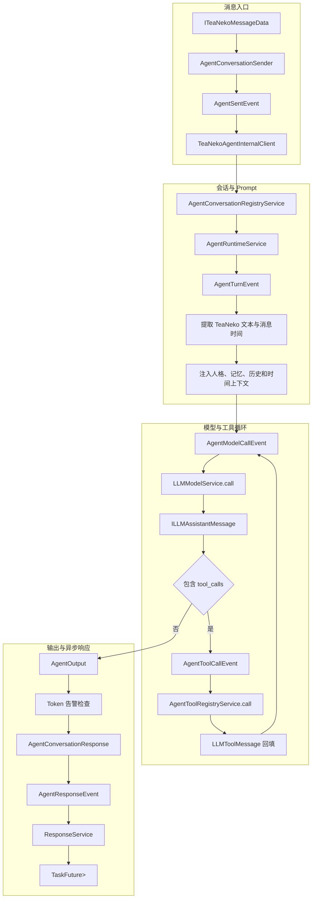
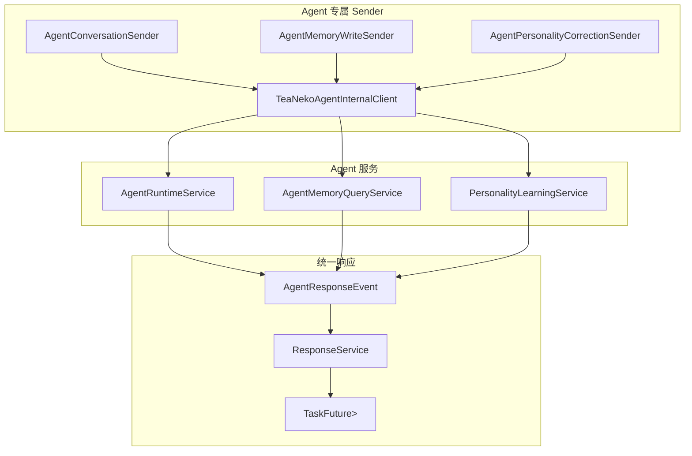

# 一. TeaNeko Agent 结构介绍

`teanekoagent` 是 TeaNeko 的 Agent 能力层，负责把 `llm` 提供的消息、Prompt、模型调用和 Function Tool 能力组合成人格、记忆、工具、受控思考与对话运行时。

Agent 依赖 TeaNeko App 的通用消息、客户端、sender 和 response API，但不依赖 OneBot 等具体聊天平台适配器。运行时直接接收 `ITeaNekoMessageData`，手动能力通过 Agent 专属 sender 调用，最终由 App 通用的 `ResponseService` 完成异步任务。

| 模块 | 作用 |
|:---:|---|
| `agent` | 对话上下文、消息时间轴、上下文压缩、Agent Runtime 和会话注册。 |
| `agent.event` | 整轮对话、模型调用、工具调用和 token 告警的事件扩展点。 |
| `agent.prompt` | 将运行规则、人格、长期记忆、时间上下文和额外组件按优先级拼装为 LLM Prompt。 |
| `agent.thinking` | 受步数限制的 Agent 思考流程、公开思考摘要、最终答案和 metadata。 |
| `agent.token` | token 使用量日志、上下文快照、定期清理和告警事件。 |
| `client` | 注册 ID 为 `teaneko-agent` 的 App 内置客户端和 Agent toolbox。 |
| `client.tools` | 定义只属于 Agent 客户端的 toolbox 接口。 |
| `sender` | 手动对话、手动记忆写入和手动人格修正 sender。 |
| `response` | Agent sender 的具体响应 DTO、响应数据和响应事件。 |
| `file_config` | Agent 主配置、token 监控器和文件基础人格配置模型及读取服务。 |
| `memory` | 带事件时间和重要度的长期记忆、时间范围查询和显式记忆工具。 |
| `personality` | 根据 scope、agentId、userId 解析 active personality、边界策略、记忆和模型 options。 |
| `personality.config` | Agent 运行配置 DTO、字段校验和配置读取 port。 |
| `personality.config.app` | 基于 TeaNeko App ConfigData 的人格配置实现；仍属于 Agent 模块。 |
| `tool` | 合并 LLM framework 工具和 Agent 工具 provider，形成统一 `ILLMTool` 视图。 |
| `database` | 基于 EasyData 的 LLM/Agent 相关 KV 数据入口。 |
| `llm` | 通用 LLM framework。Agent 复用 message、prompt、model、response 和 tool 抽象。 |
| `_app_config` | Agent 自身的 Spring 装配配置。 |

# 二. 运行入口

| 类或接口 | 作用 |
|:---:|---|
| `AgentRuntimeService` | 处理一次 `ITeaNekoMessageData`，推送 Agent 运行事件，执行模型与工具循环并返回 `Optional<AgentOutput>`。 |
| `AgentContextService` | 创建和维护会话上下文，解析人格、构建 Prompt、压缩消息并持久化暂存记忆。 |
| `AgentConversationRegistryService` | 按 conversationId 复用上下文，并校验 scope 与 user 的身份边界。 |
| `AgentToolRegistryService` | 获取并执行当前 Agent 可见的 LLM Function Tool。 |
| `AgentPersonalityResolver` | 合并基础人格、运行配置、学习修正、长期记忆和模型 options。 |
| `AgentMemoryQueryService` | 按确定性 key 和时间范围查询、写入长期记忆。 |
| `TeaNekoAgentClient` | 作为特殊 `ITeaNekoClient` 注册到 App，客户端 ID 为 `teaneko-agent`。 |
| `TeaNekoAgentInternalClient` | 在 App 进程内执行结构化 Agent send data。 |
| `ITeaNekoAgentToolbox` | 暴露 Agent 对话、记忆写入、人格修正 sender 和 logger。 |
| `AgentConversationSender` | 使用 TeaNeko 原生消息发起手动 Agent 对话。 |
| `AgentMemoryWriteSender` | 手动写入一条长期记忆。 |
| `AgentPersonalityCorrectionSender` | 手动提交受人格边界策略约束的修正。 |

# 三. 对话主流程

# 四. Agent Runtime 流程

1. `AgentConversationSender` 接收原生 `ITeaNekoMessageData`。未显式指定 conversationId 时，使用来源 client、scopeId 和平台 userId 生成稳定会话键。
2. `SenderService` 注册 echo 与 TaskFuture，然后推送 `AgentSentEvent`。
3. `TeaNekoAgentInternalClient` 识别 `AgentConversationSendData`，获取或创建 `AgentConversationContext`。
4. `AgentRuntimeService.handle(...)` 创建 `AgentTurnData` 并推送 `AgentTurnEvent`。
5. Runtime 从 `ITextTeaNekoContentPart` 提取文本，并使用 `ITeaNekoMessageData.getTime()` 写入消息发生时间。
6. `AgentContextService` 解析 active personality，注入重要记忆、历史消息、当前时间、会话时间轴和运行规则。
7. Runtime 根据配置决定是否启用结构化思考，并限制 `max-thinking-steps` 与最大工具轮数。
8. 每次模型调用通过 `AgentModelCallEvent` 执行，默认委托 `LLMModelService.call(...)`。
9. 模型返回 tool calls 时，Runtime 逐个推送 `AgentToolCallEvent`，将结果作为 tool message 回填后继续下一步。
10. 达到工具轮数或思考步数上限时，最终步骤关闭工具并要求模型形成答案，避免无界循环和额外 token 消耗。
11. 最终 assistant 消息写回会话上下文，暂存记忆持久化，Runtime 构造 `AgentOutput`。
12. token 监控器聚合本轮 usage；满足阈值时先推送 `AgentTokenWarningEvent`，事件完成后写入 warn 或向 debugger 报告。
13. 内置客户端将 `AgentOutput` 包装为 `AgentConversationResponse`，只推送 `AgentResponseEvent`。
14. App `ResponseService` 按 echo 解析响应并完成 `TaskFuture<ITaskResult<AgentConversationResponse>>`。

# 五. 手动能力流程

| 手动能力 | Sender 返回类型 | 行为 |
|---|---|---|
| 对话 | `TaskFuture<ITaskResult<AgentConversationResponse>>` | 执行完整上下文、思考、模型和工具流程。 |
| 记忆写入 | `TaskFuture<ITaskResult<AgentMemoryWriteResponse>>` | 补全 scope、agent、subject、source 与更新时间后写入长期记忆。 |
| 人格修正 | `TaskFuture<ITaskResult<AgentPersonalityCorrectionResponse>>` | 经过 active personality 和边界策略校验后写入或拒绝。 |

# 六. 客户端与 Toolbox 边界

| 能力 | Agent 客户端行为 |
|---|---|
| 结构化 Agent send data | 支持，由 `TeaNekoAgentInternalClient.send(ISendData<?>)` 执行。 |
| 原始字符串发送 | 不支持，抛出 `UnsupportedOperationException`。 |
| Agent response | 只推送 `AgentResponseEvent`。 |
| 普通消息接收事件 | 不推送 `TeaNekoMessageReceiveEvent`。 |
| `MessageSenderTools` | 不实现，调用父接口默认方法时抛出 `UnsupportedOperationException`。 |
| 群成员、平台用户、头像、踢人 | 不实现，调用时抛出 `UnsupportedOperationException`。 |
| Agent 对话、记忆、人格 sender | 由 `ITeaNekoAgentToolbox` 提供。 |

# 七. 受控思考与结构化输出

`agent.thinking` 在每次模型调用前复用当前历史消息、人格、重要记忆和时间上下文，并通过有限步骤完成分析、工具观察和最终校验。该流程是 Agent 自己组织的思考过程，不等同于模型供应商的 reasoning 模式。

| 输出部分 | 说明 |
|---|---|
| `thoughts` | 可公开的简短思考摘要，不保存或暴露模型原始链式思考。 |
| `answer` | 最终可呈现给用户的答案。 |
| `metadata` | 会话、Agent、人格来源、模型、工具次数、token、耗时和步数限制等信息。 |
| `reasoning_content` | 供应商原始推理字段不进入 AgentOutput、会话历史或用户回复。 |

新会话在首次回答前解析人格与重要记忆；已有会话每轮重新注入保留的上下文与当前时间信息。思考步数和公开摘要长度由 Agent 主配置控制。

# 八. 记忆与时间维度

| 时间或数据 | 说明 |
|---|---|
| 消息发生时间 | 来自 `ITeaNekoMessageData.getTime()`，写入会话时间轴。 |
| 消息记录时间 | 消息进入 Agent 上下文时记录，用于区分事件发生与系统记录。 |
| 记忆事件时间 | `MemoryTimeRange` 保存时间点或范围，可表达精确或模糊时间。 |
| 记忆生命周期 | `createdAt`、`updatedAt`、`expiresAt` 描述记录自身的生命周期。 |
| 时间检索 | Agent 自主将自然语言时间转换为 ISO-8601 时间点或范围，再调用记忆工具。 |
| 相对时间 | 通过 Prompt 中的当前时间、时区和消息时间轴由 Agent 解析，不维护独立自然语言时间解析器。 |

# 九. Token 监控

| 项目 | 说明 |
|---|---|
| 使用量来源 | 复用 `ILLMResult.getUsage()`，记录 API、provider、模型和各类 token。 |
| 上下文信息 | 记录消息数、字符长度、上下文窗口和估算剩余 token。 |
| 使用摘要 | 写入调试 EasyData，便于按 scope、Agent 和日期排查。 |
| 上下文快照 | 写入 `CleanableEasyData`，避免长期保存过长 Prompt。 |
| 清理策略 | 短消耗、长消耗和异常消耗使用不同保留期，可由 `token-monitor.yml` 配置。 |
| 告警顺序 | 完成一轮对话后先推送 `AgentTokenWarningEvent`，监听器处理完成后再写 warn。 |
| debugger 报告 | warning 和 abnormal 是否报告由 token 监控配置控制。 |

# 十. 配置边界

| 配置文件 | 作用 |
|---|---|
| `config/agent/main-config.yml` | Agent 默认模型 ID、思考开关、思考步数和输出摘要等主配置。 |
| `config/agent/model.yml` | 按 model ID 保存各模型的默认 options。 |
| `config/agent/personality.yml` | 文件基础人格定义、默认人格和示例。 |
| `config/agent/token-monitor.yml` | token 日志、阈值、上下文快照、清理周期和 debugger 报告配置。 |

模型配置读取位于 `teanekoagent.llm.file_config`；Agent 主配置、token 监控器配置和人格文件配置均位于 `teanekoagent.file_config`。

# 十一. 推荐阅读顺序

|顺序|导航|说明|
|---|---|---|
|$1$|[agent/README.md](agent/README.md)|了解 TeaNeko 消息如何进入 Runtime、上下文如何维护以及模型与工具循环如何结束。|
|$2$|[client/README.md](client/README.md)|了解 Agent 作为 App 内置客户端的注册方式、事件边界和不支持的平台能力。|
|$3$|[sender/README.md](sender/README.md)|了解手动对话、记忆写入和人格修正 sender 的参数与异步返回值。|
|$4$|[response/README.md](response/README.md)|了解 AgentResponseEvent 如何复用 App ResponseService 完成 TaskFuture。|
|$5$|[agent/event/README.md](agent/event/README.md)|了解整轮、模型、工具和 token 告警事件的监听与取消行为。|
|$6$|[agent/thinking/README.md](agent/thinking/README.md)|了解思考步骤预算、结构化 JSON、公开摘要、最终答案和 metadata。|
|$7$|[agent/token/README.md](agent/token/README.md)|了解 token 使用记录、上下文快照、清理策略和 warning 事件顺序。|
|$8$|[file_config/README.md](file_config/README.md)|了解 Agent 主配置与 token 监控配置的读取路径。|
|$9$|[personality/README.md](personality/README.md)|了解 active personality、边界策略、学习修正和模型参数解析。|
|$10$|[memory/README.md](memory/README.md)|了解长期记忆、关系记忆、事件时间、时间范围查询和存储方式。|
|$11$|[tool/README.md](tool/README.md)|了解 Agent 工具如何复用 LLM framework 的 Function Tool。|
|$12$|[database/README.md](database/README.md)|了解 LLM/Agent 相关 EasyData namespace 和存储约定。|
|$13$|[llm/framework/README.md](../teanekoagent/llm/framework/README.md)|了解 LLM message、Prompt、model、response、tool 和 usage 抽象。|
|$14$|[llm/file_config/README.md](../teanekoagent/llm/file_config/README.md)|了解 `model.yml` 的读取顺序和模型 options 合并规则。|
|$15$|[llm/instance/deepseek/README.md](../teanekoagent/llm/instance/deepseek/README.md)|了解 DeepSeek 请求映射、可选字段忽略和 usage 解析。|
|$16$|[llm/instance/openai/README.md](../teanekoagent/llm/instance/openai/responses/README.md)|了解 OpenAI Responses API 的消息、工具、reasoning 和 usage 映射。|
|$17$|[llm/instance/openai/completions/README.md](../teanekoagent/llm/instance/openai/completions/README.md)|了解 OpenAI Chat Completions、兼容供应商抽象模型和快速扩展方式。|
|$18$|[llm/instance/kimi/README.md](../teanekoagent/llm/instance/kimi/README.md)|了解 Kimi 如何复用 Chat Completions 通用层以及 thinking 参数限制。|

# 十二. 关键约定

| 约定 | 说明 |
|---|---|
| scopeId + agentId | 配置、人格、记忆和 Prompt 构建的统一定位键。 |
| userId | 用户画像、偏好和关系记忆的主体 ID。 |
| conversationId | 短期上下文复用键；同一 ID 不能跨 scope 或 user 复用。 |
| 原生消息 | Runtime 直接使用 `ITeaNekoMessageData`，不维护平行的 Agent 入站 DTO。 |
| 基础人格优先 | 文件或自定义基础人格不能被学习记忆覆盖。 |
| 学习内容降权 | 人格修正和长期记忆只能补充偏好、关系和表达细节。 |
| LLM 复用边界 | Agent 使用 `ILLMMessage`、`LLMPrompt`、`LLMModelOptions`、`ILLMTool` 和 `ILLMToolCall`，不新增平行抽象。 |
| App 依赖方向 | Agent 可以依赖 App 通用 API；`teanekoapp` 不包含或依赖任何 Agent 专属实现。 |
| 平台隔离 | Agent 不依赖具体聊天平台 client、post event 或平台 sender。 |
| 事件驱动边界 | 可扩展节点使用 `teanekocore.event`，监听器可修改事件 data 或取消默认动作。 |
| tool call loop | 工具调用必须有最大轮数，工具异常作为 tool message 回填给模型。 |
| 内置客户端事件 | Agent 操作只产生 `AgentResponseEvent`，不进入普通平台消息事件链。 |
| 异步返回 | Agent sender 返回 `TaskFuture<ITaskResult<具体响应>>`，不在 sender 内同步等待结果。 |
| token 监控 | 模型调用后记录 usage，单轮结束后按阈值推送告警事件并记录日志。 |
| 时间维度 | 会话区分发生时间和记录时间；记忆区分事件时间与记录生命周期。 |
