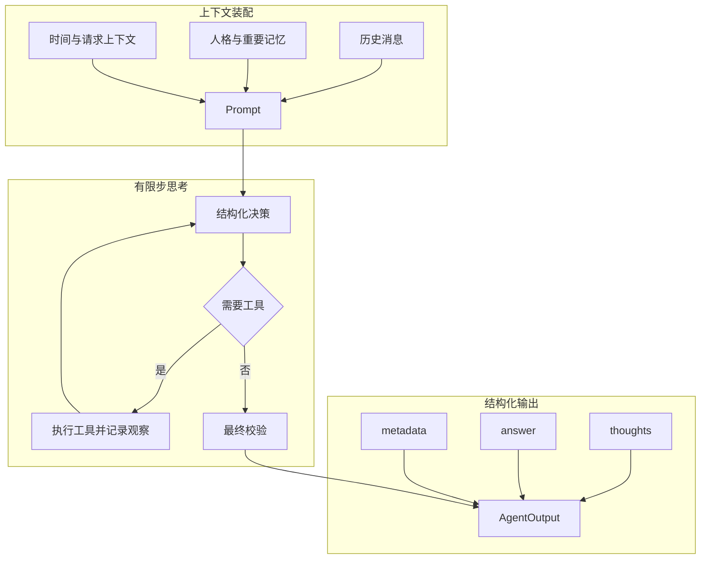

# Agent Thinking 模块

`agent.thinking` 提供由 Agent Runtime 控制的有限步思考流程。该模块不会读取或公开模型供应商的原始 `reasoning_content`，只保存模型按约束生成的简短、高层、可审计思考摘要。

## 核心类型

|类型|作用|
|---|---|
|`AgentThinkingService`|生成结构化决策 Prompt、解析模型 JSON，并限制思考摘要长度。|
|`AgentModelDecision`|单次模型调用的受控输出格式，包含 `thoughtSummary`、`answer` 和 `confidence`。|
|`AgentThoughtStep`|一条可公开思考摘要，区分分析、工具观察和最终校验。|
|`AgentOutput`|单轮完整输出，包含思考摘要、最终用户答案和运行时 metadata。|
|`AgentOutputMetadata`|记录模型调用、工具调用、token、人格、记忆和步骤预算信息。|

## 执行流程

## Token 控制

|配置|默认值|说明|
|---|---:|---|
|`thinking-enabled`|`true`|启用受控思考和 JSON 决策输出。|
|`max-thinking-steps`|`3`|包含最终回答步骤；最后一步会关闭工具并强制收束。|
|`max-thought-summary-length`|`240`|限制每条公开摘要字符数。|
|`include-thoughts-in-output`|`true`|控制 `AgentOutput` 是否保留摘要，不影响实际思考流程。|

普通问题可以在第一次模型调用直接生成答案。只有需要记忆、时间检索或其他外部能力时才继续调用工具，因此不会为了形式固定消耗多轮 token。

## 输出边界

|内容|是否进入 `AgentOutput`|是否发送给用户|
|---|---|---|
|高层思考摘要|按配置保留|否|
|工具名称和是否获得结果|保留为观察摘要|否|
|工具完整结果|否，仅保留在 tool message 上下文|否|
|最终答案|是|是|
|供应商 `reasoning_content`|否|否|

## 推荐阅读顺序

|顺序|导航|说明|
|---|---|---|
|$1$|[Agent Runtime](../README.md)|了解思考流程如何嵌入对话、工具和事件链路。|
|$2$|[人格模块](../../personality/README.md)|了解新会话注入的人格、边界和长期记忆来源。|
|$3$|[LLM Framework](../../llm/framework/README.md)|了解结构化输出使用的 Prompt、模型参数和 Tool 抽象。|
