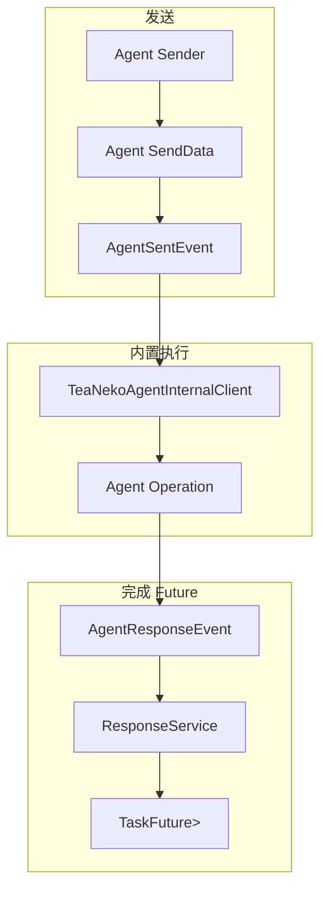

# 一、Agent Sender

Agent sender 复用 App 的 `SenderService`、`SentEvent`、echo 注册和 `ResponseService`。所有公开操作均返回 `TaskFuture<ITaskResult<具体响应>>`。

| Sender | 输入 | 响应 |
|---|---|---|
| `AgentConversationSender` | `ITeaNekoMessageData`、会话 ID、Agent ID | `AgentConversationResponse` |
| `AgentMemoryWriteSender` | scope、Agent、用户与 `AgentMemoryRecord` | `AgentMemoryWriteResponse` |
| `AgentPersonalityCorrectionSender` | 人格字段、内容、来源与置信度 | `AgentPersonalityCorrectionResponse` |

# 二、异步链路

# 三、推荐阅读顺序

|顺序|导航|说明|
|---|---|---|
|$1$|[../client/README.md](../client/README.md)|了解执行这些 send data 的内置客户端。|
|$2$|[../response/README.md](../response/README.md)|了解响应数据如何完成 TaskFuture。|
|$3$|[../memory/README.md](../memory/README.md)|了解手动记忆写入的数据结构。|
|$4$|[../personality/README.md](../personality/README.md)|了解人格修正的边界策略。|
