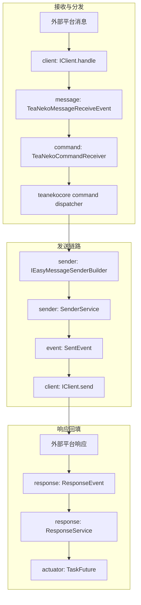

# 一. TeaNeko App 结构介绍

`teanekoapp` 是 TeaNeko 的应用层包，负责把 `teanekocore` 提供的任务、事件、命令、配置和数据能力组装成面向聊天平台适配器的统一运行模型。

| 模块 | 作用 |
|:---:|---|
| `client` | 客户端适配器抽象、客户端扫描注册、平台工具箱接口。 |
| `message` | 统一消息模型、消息内容片段、消息接收事件和内容片段扫描。 |
| `sender` | 统一发送模型，负责发送事件、异步响应 future 和发送器构建器接口。 |
| `response` | 客户端响应数据模型，通过 `echo` 关联发送请求与异步任务结果。 |
| `command` | 将消息转换为 core 命令数据，并提供帮助、权限、作用域相关内置命令。 |
| `config` | 面向聊天作用域的配置命令、配置命名空间和配置 key。 |
| `teauser` | TeaNeko 用户 UUID 与平台用户 ID 的映射，以及用户金币数据入口。 |
| `utils` | 作用域 ID 序列化/反序列化和版本号读取工具。 |
| `_app_config` | Spring/JPA/WebSocket 等应用配置类，属于启动装配层，本文档未展开。 |

# 二. 运行入口

`TeaNekoAppApplication` 是 Spring Boot 入口：

| 类 | 作用 |
|:---:|---|
| `TeaNekoAppApplication` | 使用 `@SpringBootApplication(scanBasePackages = {"org.zexnocs"})` 扫描整个 `org.zexnocs` 包，并在 JVM 关闭时关闭 Spring context。 |

# 三. 主流程

# 四. 阅读顺序

| 顺序 | 导航 | 说明 |
|---|---|---|
| $1$ | [client/README.md](client/README.md) | 平台适配器如何接入、客户端如何注册和暴露工具箱能力。 |
| $2$ | [message/README.md](message/README.md) | 消息数据、内容片段、接收事件和消息扫描机制。 |
| $3$ | [sender/README.md](sender/README.md) | 发送数据模型、发送器注册、发送事件和 easy sender builder。 |
| $4$ | [response/README.md](response/README.md) | 发送请求与异步响应如何通过 `echo` 和 `TaskFuture` 对接。 |
| $5$ | [command/README.md](command/README.md) | 应用层如何把消息转换为 core 命令并提供内置命令。 |
| $6$ | [config/README.md](config/README.md) | 聊天作用域配置命令、配置 namespace 和配置 key 约定。 |
| $7$ | [teauser/README.md](teauser/README.md) | TeaNeko 用户 UUID、平台用户 ID 映射和用户数据入口。 |
| $8$ | [utils/README.md](utils/README.md) | 作用域 ID 序列化/反序列化和版本号读取工具。 |

# 五. 关键约定

| 约定 | 说明 |
|---|---|
| Client ID | `ITeaNekoClient.getClientId()` 是平台适配器的稳定标识，会参与 group scope 和配置 key 生成。修改后旧作用域数据可能失效。 |
| scope ID | 私聊使用 `private@<uuid>`，群聊使用 `<clientId>-group@<groupId>`。 |
| echo | 发送数据的响应匹配键。建议使用 UUID 字符串，`SenderService` 会优先把它作为 task key。 |
| 消息内容片段 | 默认内容片段使用 `TeaNeko-` 前缀注册，例如 `TeaNeko-text`、`TeaNeko-image`。平台可自定义实现并使用自己的前缀。 |
| API 分层 | `teanekoapp` 定义平台无关协议；具体 OneBot、Telegram 等平台应在适配器包中实现这些接口。 |
