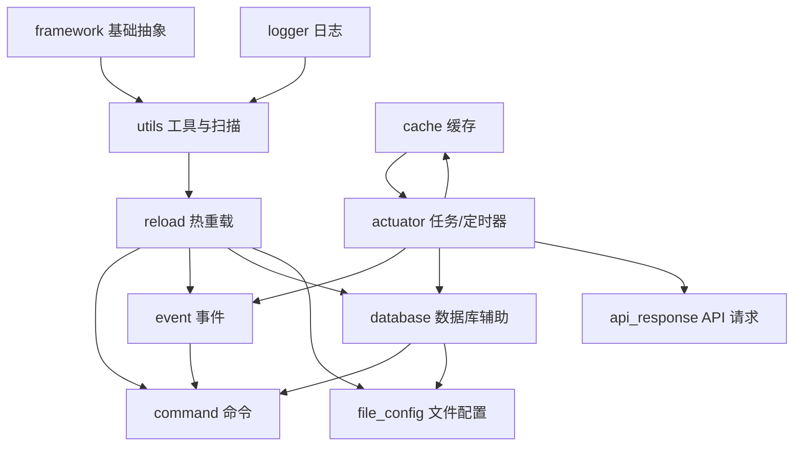

# TeaNeko Core 模块总览

`org.zexnocs.teanekocore` 是 TeaNeko App 的核心公共能力包，包含异步任务、定时器、缓存、事件、命令、数据库辅助、文件配置、热重载、日志和基础工具等模块。

本文档用于导航各子模块 README。`_app_config` 是 Spring 配置目录，当前按要求不单独补模块文档。

# 一. 模块导航

| 模块 | README | 主要职责 |
|:---:|---|---|
| `actuator` | [actuator/README.md](actuator/README.md) | 异步任务、任务阶段链、重试、定时器。 |
| `api_response` | [api_response/README.md](api_response/README.md) | 声明式 HTTP API 请求、WebClient 异步响应、响应缓存。 |
| `cache` | [cache/README.md](cache/README.md) | 通用缓存容器、TTL、自动清理和手动清理。 |
| `command` | [command/README.md](command/README.md) | 命令注解扫描、参数解析、权限/作用域校验、命令事件。 |
| `database` | [database/README.md](database/README.md) | 数据库事务任务、EasyData、ConfigData、ItemData。 |
| `event` | [event/README.md](event/README.md) | 事件模型、监听器扫描、同步/异步监听器、事件链。 |
| `file_config` | [file_config/README.md](file_config/README.md) | 本地 JSON/YAML 配置加载、模板复制、写回和热重载。 |
| `framework` | [framework/README.md](framework/README.md) | 基础数据结构、状态机、生命周期、函数式接口和描述注解。 |
| `logger` | [logger/README.md](logger/README.md) | 统一日志接口和默认 SLF4J 实现。 |
| `plugin` | [plugin/README.md](plugin/README.md) | 预留插件目录，目前无 Java API。 |
| `reload` | [reload/README.md](reload/README.md) | 热重载接口、扫描器抽象类和统一重载服务。 |
| `utils` | [utils/README.md](utils/README.md) | 日期、异常、反射字段、方法引用、JSON 描述、Bean/Class 扫描工具。 |

# 二. 依赖关系

实际代码中存在少量互相协作关系，例如 `cache` 通过 `TimerService` 注册清理任务，而 `TaskService` 又使用缓存容器保存任务；这些关系由 Spring 的懒加载和接口注入处理。

# 三. 推荐阅读顺序

| 目标 | 建议阅读 |
|---|---|
| 理解核心执行模型 | `framework` -> `logger` -> `cache` -> `actuator` |
| 理解扫描和热加载 | `utils` -> `reload` -> 对应业务模块 README |
| 接入命令系统 | `event` -> `command` -> `database/easydata` |
| 接入持久化配置 | `database` -> `file_config` |
| 发起外部 API 请求 | `cache` -> `actuator` -> `api_response` |

# 四. 关键约定

| 约定 | 说明 |
|---|---|
| `TaskFuture.finish()` | `actuator`、`event`、`database`、`api_response` 返回的 `TaskFuture` 链尾应调用 `finish()`，否则异常可能不会被统一日志记录。 |
| 扫描器热重载 | 继承 `AbstractScanner` 的扫描器要在 `_clear()` 清理旧数据，在 `_scan()` 重建缓存。 |
| namespace | 多数模块用 namespace 分隔阶段链、配置域或数据域，含义依模块不同，不要混用。 |
| DTO 修改 | 数据库 DTO 通常只读或缓存读；写操作应通过对应 task config 提交。 |
| 配置目录 | 本地文件配置默认位于运行目录下的 `config/`，模板位于 classpath `templates/config/`。 |

# 五. 入口类与配置目录

| 路径 | 说明 |
|---|---|
| `TeaNekoCoreApplication.java` | Spring Boot 启动类。 |
| `_app_config` | 线程池、Jackson、工具类和核心 Bean 配置。本文档不展开。 |
| `plugin` | 预留目录，当前没有代码。 |

后续新增模块时，建议在对应目录新增 README，并在本文件的模块导航和依赖关系中补充入口说明。
